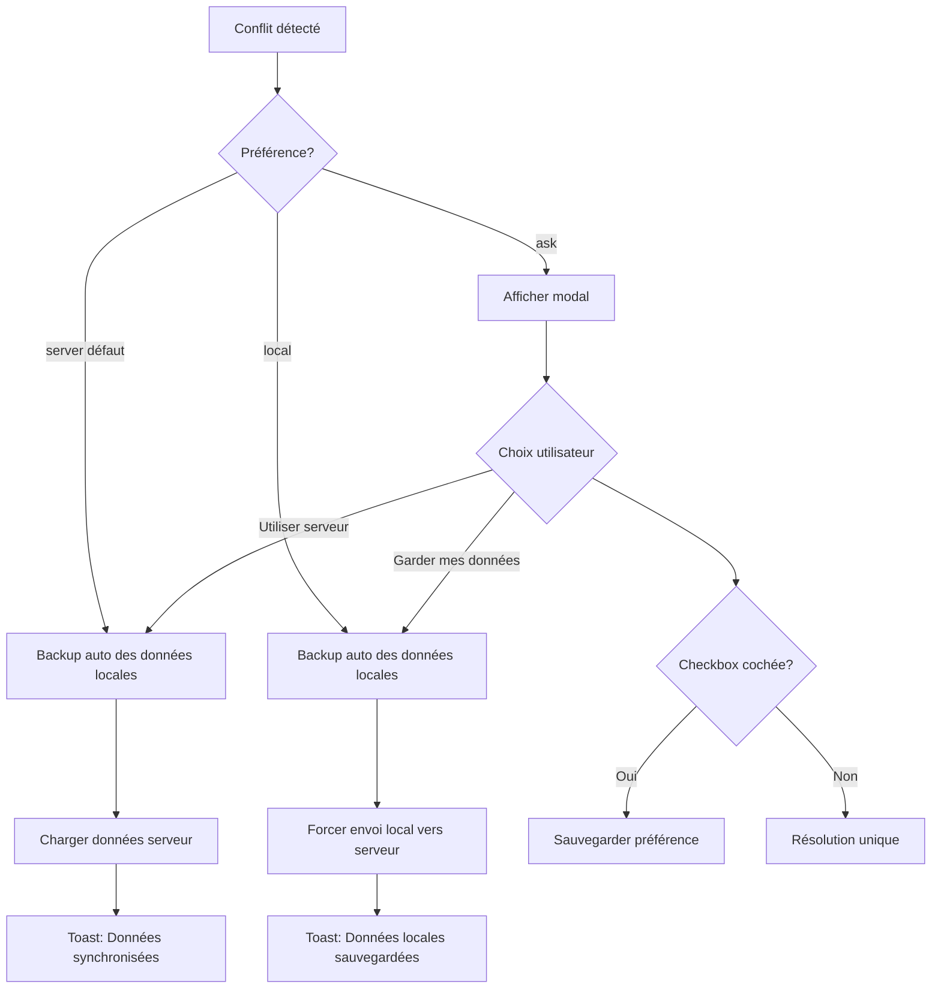

# Résolution de Conflits Multi-Appareils - Option B

## Vue d'ensemble

Le système implémente une résolution de conflits **intelligente et non-intrusive**, similaire aux apps grand public comme Instagram ou Google Drive.

---

## Comportement par défaut

### Stratégie "server" (défaut)
**Comme : Instagram, Twitter, Facebook**

Quand un conflit est détecté entre deux appareils :
1. ✅ Backup automatique des données locales dans `localStorage`
2. ✅ Chargement des données du serveur (plus récentes)
3. ✅ Toast informatif : "Données synchronisées (backup local sauvegardé)"
4. ✅ **Aucune modal** - totalement transparent pour l'utilisateur

**Avantages :**
- UX fluide, pas de friction
- L'utilisateur n'a pas besoin de comprendre les concepts de sync
- Comme toutes les apps connues

**Sécurité :**
- Les données locales ne sont jamais perdues (backup automatique)
- 10 derniers backups conservés dans `localStorage`
- Récupérables manuellement si besoin

---

## Fonctionnalités

### 1. Backup automatique

Avant chaque écrasement de données, un backup est sauvegardé :

```javascript
// Structure du backup
{
    timestamp: "2026-01-25T15:30:00.000Z",
    entity: "training_settings",
    data: { /* toutes les données locales */ }
}
```

**Localisation :** `localStorage.getItem('conflict-backups')`
**Limite :** 10 derniers backups conservés

### 2. Préférence utilisateur

Trois options disponibles dans `state.preferences.conflictResolution` :

| Valeur | Comportement |
|--------|--------------|
| `'server'` | **(Défaut)** Toujours utiliser les données du serveur + backup local |
| `'local'` | Toujours forcer l'envoi des données locales vers le serveur + backup |
| `'ask'` | Afficher la modal pour demander à l'utilisateur à chaque fois |

### 3. Modal de résolution (optionnelle)

Si l'utilisateur définit `state.preferences.conflictResolution = 'ask'` :

**Affichage :**
- Timestamp de la dernière modification locale
- Timestamp de la modification serveur
- Checkbox "Toujours utiliser cette option"
- 2 boutons : "Garder mes données" / "Utiliser le serveur"

**Comportement checkbox :**
- Si cochée : sauvegarde la préférence dans `state.preferences.conflictResolution`
- Les futurs conflits seront résolus automatiquement

---

## Comment changer la préférence

### Méthode 1 : Via la modal de conflit
1. Définir `state.preferences.conflictResolution = 'ask'`
2. Créer un conflit (modifier sur 2 appareils)
3. La modal s'affiche
4. Cocher "Toujours utiliser cette option"
5. Choisir "Garder mes données" ou "Utiliser le serveur"

### Méthode 2 : Directement dans le code
```javascript
// Dans la console du navigateur
state.preferences.conflictResolution = 'local'; // ou 'server' ou 'ask'
saveState();
```

### Méthode 3 : Ajouter un menu de paramètres (TODO)
Créer une page de settings avec :
- Radio buttons pour choisir la stratégie
- Bouton pour voir l'historique des backups
- Bouton pour restaurer un backup

---

## Flow complet



---

## Exemples de scénarios

### Scénario 1 : Utilisateur standard (défaut)
**Contexte :** Tu configures ton programme sur le téléphone, puis sur le PC

1. Sur téléphone à 14h30 : configure programme Full Body
2. Sur PC à 14h35 : configure programme Upper/Lower
3. Retour sur téléphone à 14h40
4. **Résultat :** 
   - Backup auto de Full Body dans `conflict-backups`
   - Chargement de Upper/Lower (plus récent)
   - Toast : "Données synchronisées (backup local sauvegardé)"
   - **Aucune modal**

### Scénario 2 : Power user (préférence 'local')
**Contexte :** Tu veux toujours garder tes modifications locales

1. Dans la console : `state.preferences.conflictResolution = 'local'; saveState();`
2. Conflit détecté
3. **Résultat :**
   - Backup auto des données serveur
   - Force l'envoi des données locales vers serveur
   - Toast : "Vos données locales ont été sauvegardées"
   - **Aucune modal**

### Scénario 3 : Contrôle total (préférence 'ask')
**Contexte :** Tu veux décider à chaque fois

1. Dans la console : `state.preferences.conflictResolution = 'ask'; saveState();`
2. Conflit détecté
3. **Résultat :**
   - Modal s'affiche avec les timestamps
   - Tu choisis manuellement
   - Option de cocher "Toujours utiliser cette option" pour revenir au mode auto

---

## Récupération d'un backup

Si tu veux récupérer une ancienne version :

```javascript
// 1. Voir les backups disponibles
const backups = JSON.parse(localStorage.getItem('conflict-backups') || '[]');
console.table(backups.map(b => ({ date: b.timestamp, entity: b.entity })));

// 2. Récupérer un backup spécifique (exemple : le plus récent)
const latestBackup = backups[backups.length - 1];

// 3. Restaurer les données (attention : écrase les données actuelles)
state = { ...state, ...latestBackup.data };
saveState();

// 4. Forcer la sync vers Supabase
await saveTrainingSettingsToSupabase();
```

---

## Comparaison avec les apps populaires

| App | Stratégie | Modal ? | Backup ? |
|-----|-----------|---------|----------|
| **Instagram** | Last Write Wins | ❌ | ❌ |
| **Twitter** | Last Write Wins | ❌ | ❌ |
| **Google Docs** | Merge auto | ❌ | ✅ (historique) |
| **Dropbox** | Fichier conflit | ❌ | ✅ (versions) |
| **Notion** | Merge auto | ❌ | ✅ (historique) |
| **REPZY (défaut)** | Last Write Wins | ❌ | ✅ (10 derniers) |
| **REPZY (ask)** | Choix utilisateur | ✅ | ✅ (10 derniers) |

---

## Améliorations futures possibles

### 1. Page de paramètres
Ajouter dans l'UI un menu pour :
- Choisir la stratégie (server/local/ask)
- Voir l'historique des conflits
- Restaurer un backup avec un clic

### 2. Merge intelligent
Pour certaines données (comme `sessionTemplates`), merger automatiquement :
```javascript
// Garder les templates des deux appareils
mergedTemplates = {
    ...localTemplates,
    ...serverTemplates
}
```

### 3. Notification push
Si un conflit critique est détecté sur un autre appareil, envoyer une notification push.

### 4. Historique détaillé
Afficher un diff visuel des changements entre local et serveur.

---

## Conclusion

**L'Option B est implémentée** avec :
- ✅ Backup automatique (10 derniers)
- ✅ Résolution automatique par défaut (comme Instagram)
- ✅ Préférence utilisateur configurable
- ✅ Modal optionnelle pour contrôle total
- ✅ Toast informatif non-bloquant

**UX finale :** Transparente et fluide pour 99% des utilisateurs, avec contrôle total pour les power users.
